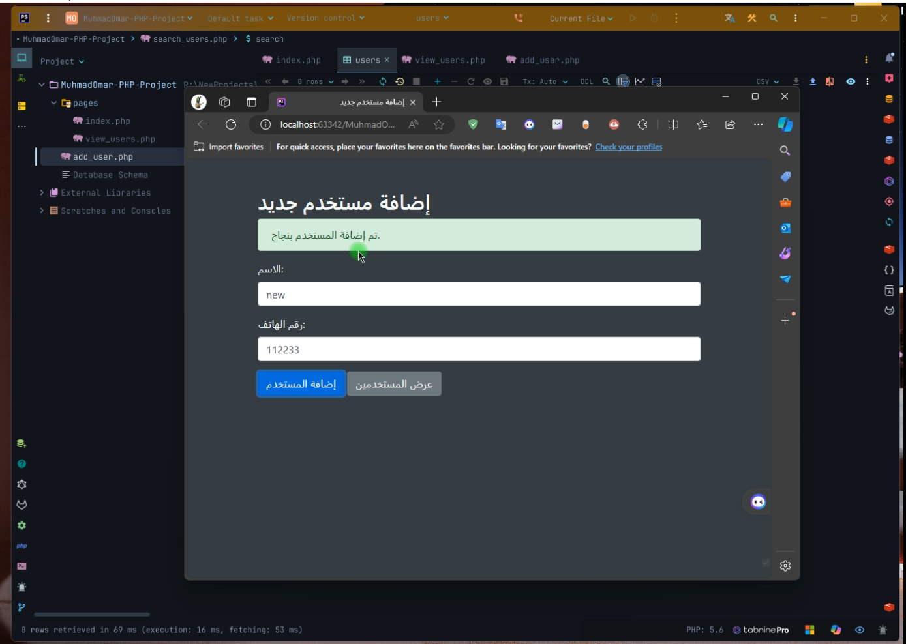

# PHP-User-Management-2024
For Exam Web Application 2, PHP-User-Management-2024

### وصف المشروع 
- أريد صفحة لإضافة مستخدم جديد(الاسم, رقم الهاتف)
- أريد صفحة يمكنني رؤية جميع المستخدمين وأيضا البحث عن مستخدم ما
  - البحث يكون إما عن طريق الاسم أو رقم الهاتف(بشرط أن يكون حقل واحد)

### Tools 
- PHP 8.3
- PostgreSQL
- IDE PHPStorm

 

[Click here to => Youtube Video](https://youtu.be/tprnZ5gq9UA)

 
 

